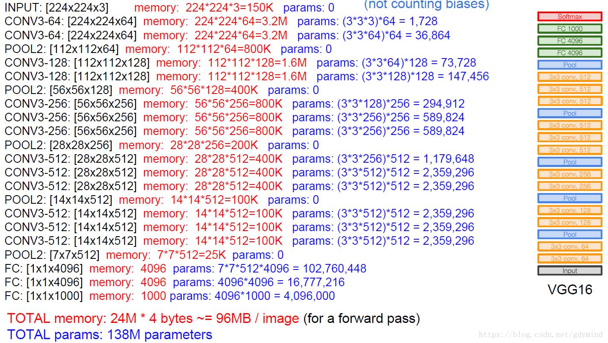
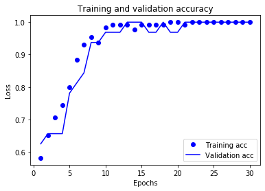

# CSCE-636-Part-5-Report

## 1. Research Topic

**Smart Home** now has become a very popular topic recently. And deep learning techniques are also widely applied in this field for different sorts of video classification tasks. 

For this project, I am trying to design a kind of "smart home", where we can use cameras to observe whether an old person living there is slipping or fainting so that we can decide whether to call someone to help the slipped/fainted person and prevent some bad things happened in advance.

So the main topic and challenge of this project mainly focus on how to detect the person living in our house is slipping or fainting. And I implemented a model for detecting "slipping" or "fainting" actions using a recurrent convolutional neural network architecture (CNN + LSTM). 

<br/>

## 2. Method

### 2.1. Algorithm

Since videos can be considered as a series of frames of images and CNN models are very common to be used in image classification, intuitively I would tend to use CNN to extract the spatial features of each video frame, and then feed them to the LSTM network to obtain sequence timing features. 

First, our model requires the use of CNN. The CNN consists of multiple layers such as Convolution Layer, Pooling Layer, Batch Normalization Layer, etc. Each of these layers will affect the data to extract or tune the features that the network learns. The convolution layer runs small convolutional filters on the input images to extract important features. Pooling Layer comprises and normalizes the output of the convolution layer. 

The other network structure we use later is LSTM. LSTM is an optimized variant of the basic RNN. Like RNN, LSTM also requires sequence as the input, stores some hiden states, and also outputs a output sequence. The LSTM is different from the RNN because the LSTM uses a forget gate to clear the memory during a short period so that it does not cram all the the information that it receives into its memory/states because not all information may be useful.

My algorithm connects CNN to LSTM, then to a fully connected layer and get the prediction output. The main architecture shows in the following figure:


### 2.2. Framework/Machines

I use Python + Keras + Tensorflow as the main framework for our entire project. First, I trained my model on my own machine for small scale of data. Later, I moved all my work to Google Cloud for access to CUDA-enabled GPUs for faster training. 

I lent a virtual computing machine instance with Ubuntu 16.04 + 4CPU + 15GB mem + 1 NVIDIA Tesla T4. After installing NVIDIA driver, CUDA 10.1, Anaconda, Tensorflow and Keras, I could connect to that server and run my experiments on Jupyter.

### 2.3. Network Architecture

After reading some papers and codes in video classification field, I mainly tried 3 different neural network structures and see how they perform respectively.


#### 2.3.1. CNN+LSTM model

The first network I tried is simply using LSTM after CNN. The architecture shows in the following figure:


```python
model = Sequential()
model.add(TimeDistributed(Conv2D(64, (7, 7), activation='relu'), input_shape=(frames, rows, columns, channels)))
model.add(TimeDistributed(MaxPooling2D((2, 2))))
model.add(TimeDistributed(Conv2D(96, (5, 5), activation='relu')))
model.add(TimeDistributed(MaxPooling2D((2, 2))))
model.add(TimeDistributed(Conv2D(128, (3, 3), activation='relu')))
model.add(TimeDistributed(Conv2D(128, (3, 3), activation='relu')))
model.add(TimeDistributed(Conv2D(192, (3, 3), activation='relu')))
model.add(TimeDistributed(MaxPooling2D((2, 2))))
model.add(TimeDistributed(Flatten()))
model.add(TimeDistributed(Dense(512)))
model.add(LSTM(256, return_sequences=True))
model.add(TimeDistributed(Dense(1024, activation='relu')))
model.add(GlobalAveragePooling1D())        
model.add(Dense(1, activation='sigmoid'))
          
model.compile(loss='binary_crossentropy', optimizer=RMSprop(lr=0.01), metrics=['accuracy'])
```

First, I used 64 7\*7 filter for the input layer and following a 2\*2 max pooling layer. Then I shrink the filter size and increase the number of filters, and repeat adding this kinds of convolution layers to increase the depth of our network.

Later, flatten the output of CNNs and feed them to the following LSTM layer. Since I want to get all historical output of LSTM and do a global average pooling, I set `return_sequences` to `true` here.

Finally, I add a single neuron with sigmoid activation since we are doing a binary classification job. And I set RMSprop as the optimizer with learning rate 0.01 since I saw many posts on the Internet discussed that we always prefered to set lr to 0.1 or 0.01 initially.

#### 2.3.2 VGG16+LSTM model

The performance of my first model was not that good after I tuned the parameters and add some layers to make my model deeper. After I read some posts on the Internet, I found many people said that after the birth of VGGNet, the 3 * 3 small convolution kernel became the mainstream of the CNN network design. Two 3 * 3 convolution kernels have the same receptive field as one 5 * 5 convolution kernel and also has the smaller group of parameters and more nonlinear transformations in contrast of one 5 * 5 convolution kernel. So I turned my eyes to this VGGnet and modified my model to the following version:


```python
model = Sequential()
model.add(TimeDistributed(VGG16(input_shape=(rows, columns, channels), weights="imagenet", include_top=False)))
model.add(TimeDistributed(GlobalAveragePooling2D()))
model.add(LSTM(256, return_sequences=True))
model.add(TimeDistributed(Dense(1024, activation='relu')))
model.add(GlobalAveragePooling1D())
model.add(Dense(1, activation='sigmoid'))

model.compile(loss='binary_crossentropy', optimizer=RMSprop(lr=0.01), metrics=['accuracy'])
```

Compared to the previous model, the main difference is the replacement from serveral CNN layers to a VGG16 network.

Below is a figure in which shows the architecture and parameter summary of VGG16:



We can see VGG16 is a network with 16 layers and 138 million parameters. The VGG16 network has a simple and beautiful structure: after each pooling, the size is shrunk by half, while the number of channels is doubling. The disadvantage is also quite clear: The number of parameters to be trained is very large. When I first tried VGG16 on my own machine, it couldn't work even I reduce my train batch size to 1 due to OOM.

<br/>

## 3. Dataset

### 3.1. Add Body Landmarks

In order to make the human body more easy to be detected by our model and gain a better accuracy, we can use the open-source project [openpose](https://github.com/CMU-Perceptual-Computing-Lab/openpose) to add skeleton landmarks for our videos. 

The processing result is shown below:


I compiled this project on my computer and processed all the videos in my dataset.

### 3.2. CASIA Action Database

Initially, I tried to use the [CASIA Action Database for Recognition](http://www.cbsr.ia.ac.cn/english/Action%20Databases%20EN.asp) as the train set and use some short clips of videos I record by myself as the testing dataset in the part 4. 

CASIA dataset contains eight different types of actions of single person from 3 different perspectives, such as walking, running, bending, jumping, crouching, fainting, wandering and punching a car. 


And I only used the videos of horizontal view for training. After using OpenPose to add body landmarks, I got some processed videos like below:


We can find a obvious problem is that the video resolution is low and in some frames the landmark data is not added correctly or even not added.

I trained my model on these dataset and only got an accuracy of 0.53. It's only a little bit better than the random guess. So I decided to record some videos and use them as the dataset.

### 3.2. Self-made Action Dataset

I records 161 videos in total including the following 8 actions: bend, crouch, faint, run, walk, jump, slip, squat. All these 161 videos are used as train set and validation set. For the test set, I asked some of my friends to record  videos in total and use these 55 videos as test set.

All videos are recorded in the horizontal view.

Train & validation set:


Test set:


All the datasets are uploaded on Google Drive: https://drive.google.com/open?id=1dkCMLELa6w3iiicB3t2Ltly62XSDEJsK


We can find a great improvement in the video resolution and body landmark accuracy in our new datasets compared to the CASIA dataset.

<br/>

## 4. Implementation

The implementation mainly consists of 3 parts: data preprocessing, model training and model evaluation. These 3 parts are implemented in the 3 python scripts `data_preprocessing.py`, `model_train.py`, `model_evaluate.py`. You can also see how they work in the jupyter notebook `model.ipynb`.

### 4.1. Data Preprocessing

First, we will use the `cv2` library to convert video to frames. Then, in order to make all frame arrays have same length, we will get the median of the frame lengths and use this median to normalize all frame arrays to the same length. The normalization method is to truncate the excess frames in the two ends or pad the missing frames using the head & tail frame.

On my self-made dataset, the shape of the normalized frame arrays is `(129, 136, 240, 320, 3)`, which represent number of samples, frames, rows, columns and channels, respectively.

### 4.2. Train Model

At first, I use a smaller dataset to train and test my model on my personal computer. But soon I found that my computer always throws OOM exceptions during the VGG16 training process.

Then I turn to use TAMU HPRC cluster, but it still doesn't work. Finally, I set up a GPU environment on Google Cloud and use remote jupyter connection to train and test my model.

I mannually divide 20% of my train dataset as my validation dataset. And at first I set the binary cross entropy as the loss and use Adam as the optimizer with a learning rate of 0.01, since many posts on the Internet suggest to initialize lr to 0.01. Then I train 30 epochs with a batch_size of 4. 

But I found that it still always throws OOM exceptions. And even I set the batch_size to 1, the memory still runs out. After I searched some posts on the Internet, I found that using Stochastic gradient descent (SGD) instead of Adam as the optimizer would cost less memory. 

Then after I change my optimizer to SGD, it finally works. But the training accuracy is very close to 0.6, which means it's a little bit better than the random guess. After I tuned the learning rate to `0.00005`, the training & validation accuracy is finally close to 1.

```python
# set SGD optimizer and compile the model
optimizer = SGD(lr=0.00005, decay = 1e-6, momentum=0.9, nesterov=True)
model.compile(loss="binary_crossentropy",
              optimizer=optimizer,
              metrics=["accuracy"])

# set checkpoint for saving models automatically in every epoch
checkpoint = ModelCheckpoint('vgg16_lstm_model_{epoch:d}.h5', period=1)

# set validation set and train the model
history = model.fit(train_data, train_label, epochs=30, batch_size=3, 
                    validation_data=(valid_data, valid_label), callbacks=[checkpoint])
```

And I set a checkpoint for recording models automatically in every epoch. Each epoch will be save in the file pattern`vgg16_lstm_model_{epoch}.h5`.

The below figures shows the training & validation loss and accuracy: 


### 4.3. Evaluate Model

I evaluate the models of each epochs on my test dataset. The best accuracy is about `0.69`.

And I wrote a script for using the best model to predict for the other new videos. Here's the demo of testing on new videos: [CSCE 636 Project Part5 Test Demo](https://youtu.be/vndHJWDN4j0).

## 5. Improvements

Since the performance on my train & validation dataset is good but it's not good on the test dataset. So one way to improve is to add some dropout layers in our model.

I have tried to add dropout layers before and after VGG16 model and LSTM model, and also set different dropout rates. The best accuracy occurs when I add dropout layer after VGG16 model with the dropout rate `0.1`. 

And I test the model with dropout layer on the test dataset. It gets the best accuracy of `0.71`, which is a little better than the model without dropout layer.

The below figures shows the training & validation loss and accuracy: 




<br/>

## 6. Experience Summarization

From this project, I gained the following experiences:

1.  When we need to use deep learning to solve a problem, it is best to first find a classic basic network structure as the basis of design, like VGG16, LSTM.
2.  If train loss tends to remain the same and test loss also tends to remain the same, indicating that learning has encountered a bottleneck and needs to reduce the learning rate
3.  train loss keeps dropping, test loss tends to be constant, indicating that the network is overfitting, we can consider trying dropout
4.  For CNN, it is now generally believed that the smaller the convolution kernel, the smaller the required parameters and the amount of calculation when the same receptive field is reached. That means it's better to use multiple 3\*3 kernels instead of a 11\*11 kernel.
5.  Compared with SGD + Momentum, the Adam optimizer will take up more memory, while the performance may not be much different.
6.  Be patient while tuning parameters and training.

<br/>

## 7. Future Work

First, if I have more time and computing resources, we can tune our parameters more rigorously with a random search.

Second, we can train our model on different datasets with more training samples.

Third, we can try to capture multiple sequences of frames from each video with some stride between the start of each sequence and then use these multiple sequences to train our model.

Fourth, we can also use datasets with different perspectives just like the CASIA Action Database. In other words, we can use 3 cameras to record a person's action from 3 different perspectives (horizontal view, angle view, top down view), and use the 3 videos of different perspectives to predict one action.

<br/>

## References

1.  [Long-term Recurrent Convolutional Networks for Visual Recognition and Description](https://arxiv.org/abs/1411.4389)
2.  [A Torch Library for Action Recognition and Detection Using CNNs and LSTMs](http://cs231n.stanford.edu/reports/2016/pdfs/221_Report.pdf)
3.  [Video-Classification-CNN-and-LSTM-](https://github.com/sagarvegad/Video-Classification-CNN-and-LSTM-)
4.  [Research on human fall behavior using CNN and LSTM-based hybrid model](http://www.arocmag.com/article/02-2019-12-056.html)
5.  [A practical theory for designing very deep convolutional neural networks](https://www.semanticscholar.org/paper/A-practical-theory-for-designing-very-deep-neural-Cao/79222fad9f671be142bd7e42cd785a2cb06a1d30)
6.  [Very Deep Convolutional Networks for Large-Scale Image Recognition](https://arxiv.org/pdf/1409.1556.pdf)