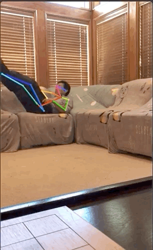
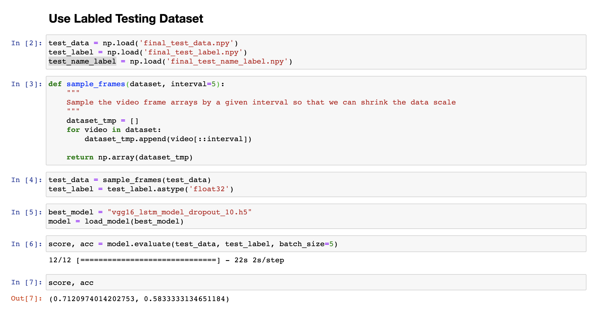
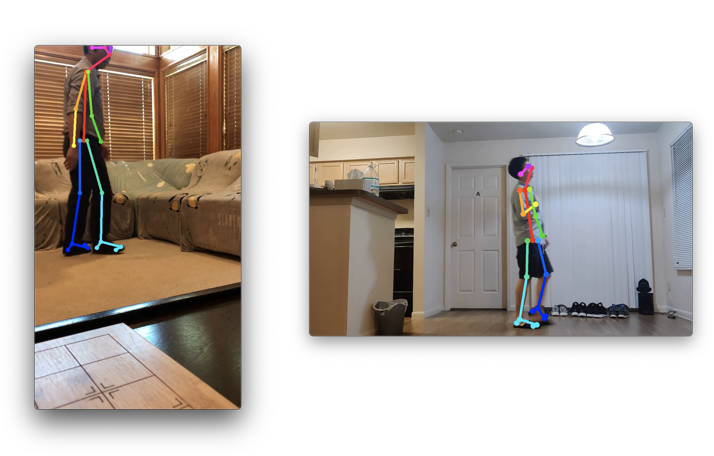
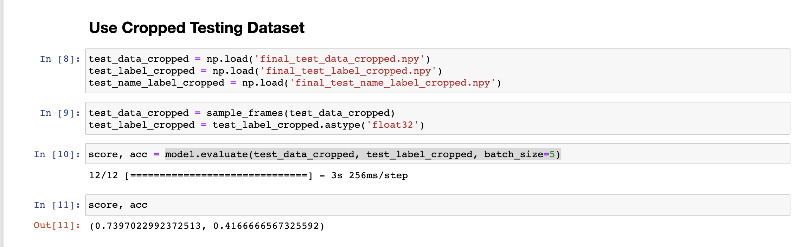
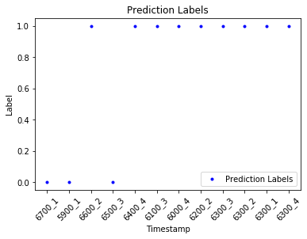

# CSCE-636-Test-Report

### 1. Add Skeleton labels

First, after downloading the videos given by Prof. Jiang, I first added skeleton labels to the videos using `openpose`.

After processing, I got the videos like the following:

### 2. Test Model on the Labled Dataset

Then, I evaluate my model on this testing dataset, but it only gets an accuracy of `0.583`:

### 3. Test Model on the Cropped Dataset

The first reason for the bad performance I consider is the shooting angle of the testing videos. My previous training and validation datasets are all of videos that has a resolution of `720 * 1080` while the testing videos given by Prof. Jiang is `1080 * 720`:

So I used a video editing software to crop the original videos and pad the left and right sides with black background. In this way, I made them all in `720 * 1080` resolution:

Then, I evaluated my model on this cropped testing dataset, but it only gets an accuracy of `0.41`:

### 4. Draw the Timeline

So the performance of the second part is better. And I use the video name label and the prediction results to draw a figure of the timeline:

I use `0.5` as the threshold here. And we can see the accuracy is only 7/12 = 0.58 which is only a little above 0.5

### 5. Analysis of the Bad Result

My model can get a very high training and validation accuracy on my training and validation datasets (almost `1.0`), and get a not bad testing accuracy on my testing dataset (about `0.71`), but get a very bad accuracy of `0.58` on the testing dataset given by Prof. Jiang.

The main reason I think is that the the types of actions in my training & testing datasets overlaps very little with the types of actions in the Prof. Jiang's testing datasets. My dataset only includes these 8 actions: bend, crouch, faint, run, walk, jump, slip, squat; while in Prof. Jiang's dataset, the main action types are: smoke, lie, vomit, squat, stretch, sit.

So I think the main direction for me to improve the testing performance is to enlarge my training dataset and extend my model to more different actions.